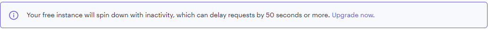
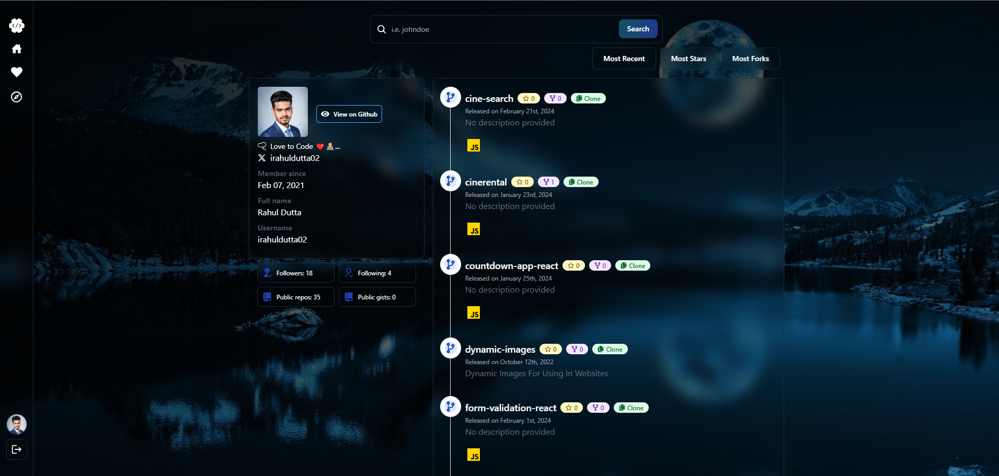

# remote-repo-mern-app

## Deployment

### [Deployed at Render 🔗](https://remote-repo-mern-app.onrender.com/)

### FYI

The app is deployed on Render on free tier. It may take up to 50 seconds or few more to load depending upon your internet speed initially. It is not a performance issue.

## Preview

## Description

### A simple MERN stack app to use capabilities of GitHub API to search and view github profiles, like profiles, share profile links and view public repositories of the user with the star and fork count.

- You can singup and then login with your GitHub account and view your profile.
- You can search for any GitHub user and view their profile.
- You can like the profile.
- You can share the profile link.
- You can view the public repositories of the user with the star and fork count.
- You can sort the repositories by star count and fork count and by most recent.
- You can copy the clone URL of the repository.
- You can explore popular repositories by popular languages. 

## Technologies

- **Frontend**
  - React for UI
  - Tailwind CSS for styling
  - React Router for routing
  - React hot toast package for toast notifications 
  - react icons package for icons
- **Backend**
  - Node.js 
  - Express 
  - Passport.js for authentication
- **Database**  
  - MongoDB 

